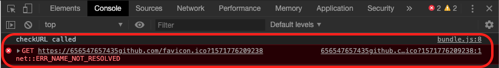

# Network Tester

The Network Tester application is a simple website that can be used to test client networks to verify  endpoints required for Application Modernization Workshops. The tests are run via a client browser using Javascript to access the required endpoints.

It can be customized to test any http/https endpoints.

## Running locally

1. Clone this repo

2. Open the file **index.html** with your browser and click on the **Start Test** button

## Running on Cloud Foundry on the IBM Cloud

1. Clone this repo.

2. Edit the file **manifest.yml** and enter a unique **host** for the Cloud Foundry application.

3. Push the application using the IBM Cloud CLI.

   ```
     ibmcloud cf push
   ```
4. Open the designated Cloud Foundry route in your browser.

## Customizing for a specific client

To customize you'll need to install [Node.js 8.x](https://nodejs.org/en/download/) or later with **npm** and [browserify](http://browserify.org/)

1. Clone this repo

2. Modify the endpoints tested by editing the file **app.js**. Modify the function **global.handleClick** and  replace the http/https endpoints with the ones you want tested.
e.g.
```
  results.push(await checkURL("https://github.com",20,"Verifying access to github"));
  results.push(await checkURL("https://cloud.ibm.com",40,"Verifying access to IBM Cloud"));
  results.push(await checkURL("http://169.62.47.198",60,"Verifying access to Terminal Server"));
  results.push(await checkURL("https://petclinic-postgresql-petclinic.apps.ocp.kubernetes-workshops.com",80,"Verifying access to OpenShift master"));
  results.push(await checkURL("http://petclinic-postgresql-petclinic.apps.ocp.kubernetes-workshops.com",100,"Verifying access to OpenShift applications"));
```  
The **checkURL()** function takes 3 parameters for each test:
   - The URL of the endpoint to test.
   - The state of the progress bar (ie percent complete) after the test is complete.
   - The description of the endpoint to test.


3. Save changes to **app.js** and any other files and then run the following commands to regenerate the Javascript file **bundle.js**.
```
   npm install
   browserify app.js -o bundle.js
```

4. Deploy on IBM Cloud using a unique route (by modifying `manifest.yml`) with the clients name (e.g. `https://myclient-network-tester.us-south.cf.appdomain.cloud/`) and direct the client to the URL.

## Troubleshooting failed tests

Security restrictions in the browser prevent you from  getting detailed information on networking errors in Javascript so you need to look at the  Javascript console in your browser for more details about failed tests. Ask your client to look at the console if any of the tests fail and let you know what caused the error(s). Here's an example failure in the console when the host of a URL cannot be resolved:



## Working around failed tests

You should try the following sequence of actions if there are failed tests:
1. Try to get the offending URL(s) whitelisted by the client's  network security  team for the duration of the workshop(e.g this was done at GM and RBC)
2.  Have the client  disable the VPN on their laptops and use a public Wifi network (eg Morgan Stanley )
3. Host at an IBM location and have clients disable the VPN on their laptops  (eg State St. )
4. In the event clients cannot disable the VPN on their laptops even on a public network, use a public network and provide laptops for  the students.
